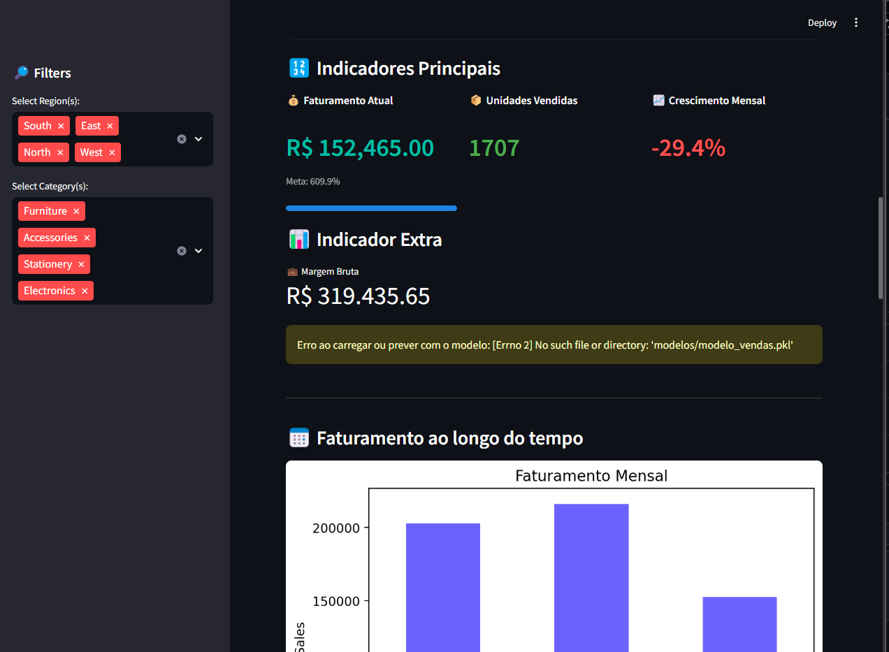

# 🛍️ Sales Dashboard with Streamlit



An interactive sales dashboard with key metrics, filters and visualizations, built using **Python**, **Pandas**, and **Streamlit**. Includes time-based analysis and regional/category breakdowns.

---

## 🚀 Features

- 📊 Monthly Revenue KPIs with meta tracking
- 🌍 Regional & Category filters
- 🗓️ Date-based range filtering
- 📦 Product and Category Sales breakdown
- 📈 Clean and modern UI with real-time updates
- 🧠 Future module for predictive analysis with ML (`ml_prediction.py`)

---

## 📁 Files Overview

| File | Description |
|------|-------------|
| `app.py` | Main dashboard app |
| `generate_sales_data.py` | Script to simulate realistic sales data |
| `ml_prediction.py` | ML module (optional future) |
| `requirements.txt` | Dependencies for the project |
| `dashboard.png` | UI preview image |

---

## 📦 Installation

```bash
# Clone the repository
git clone https://github.com/Luiz-otavio-creator/sales-dashboard-streamlit.git
cd sales-dashboard-streamlit

# (Optional) Create a virtual environment
python -m venv venv
venv\Scripts\activate  # Windows

# Install dependencies
pip install -r requirements.txt

# Run the app
streamlit run app.py
